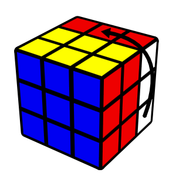

# rubiks-cube
A 3x3 Rubik's cube that you can solve in your terminal

```
Moves: 43

                        GGG                                               Y O
                    GGGGGGGGGGG                                       YYYYY OOOOO
                WWW GGGGGGGGGGG GGG                               GGGYYYYYY OOOOOOOOO
            WWWWWWWWWWW GGG GGGGGGGGGGG                       GGGGGGGYYYYYY OOOOOOOOOOOOO
        WWW WWWWWWWWWWW WWW GGGGGGGGGGG GGG               GGGGGGGGGGGYYYY Y O OOOOOOOOOOOOOOO
    WWWWWWWWWWW WWW WWWWWWWWWWW GGG GGGGGGGGGGG       GGGGGGGGGGGGGGG YYYYY OOOOO OOOOOOOOOOOOOOO
    WWWWWWWWWWW WWW WWWWWWWWWWW WWW GGGGGGGGGGG       GGGGGGGGGGG GGGYYYYYY OOOOOOOOO OOOOOOOOOOO
    RRR WWW WWWWWWWWWWW WWW WWWWWWWWWWW GGG WWW       GGGGGGG GGGGGGGYYYYYY OOOOOOOOOOOOO OOOOOOO
    RRRRRRR WWWWWWWWWWW WWW WWWWWWWWWWW WWWWWWW       GGG GGGGGGGGGGGYYYY Y O OOOOOOOOOOOOOOO OOO
    RRRRRRRRRRR WWW WWWWWWWWWWW WWW BBBBWWWWWWW       GGGGGGGGGGGGGGG YYYYY OOOOO OOOOOOOOOOOOOOO
    RRRRRRRRRRRRRRR WWWWWWWWWWW BBBBBBBBWWWWWWW       GGGGGGGGGGG GGGYYYYYY OOOOOOOOO OOOOOOOOOOO
    RRR RRRRRRRRRRRRRRR WWW BBBBBBBBBBBBWWW WWW       GGGGGGG GGGGGGGYYYYYY OOOOOOOOOOOOO OOOOOOO
    RRRRRRR RRRRRRRRRRRRR BBBBBBBBBBBBB WWWWWWW       GGG GGGGGGGGGGGYYYY BBB OOOOOOOOOOOOOOO OOO
    RRRRRRRRRRR RRRRRRRRR BBBBBBBBB BBBBWWWWWWW       GGGGGGGGGGGGGGG BBBBBBBBBBB OOOOOOOOOOOOOOO
    RRRRRRRRRRRRRRR RRRRR BBBBB BBBBBBBBWWWWWWW       GGGGGGGGGGG YYY BBBBBBBBBBB BBB OOOOOOOOOOO
    RRR RRRRRRRRRRRRRRR R B BBBBBBBBBBBBWWW WWW       GGGGGGG YYYYYYYYYYY BBB BBBBBBBBBBB OOOOOOO
    RRRRRRR RRRRRRRRRRRRR BBBBBBBBBBBBB WWWWWWW       GGG YYY YYYYYYYYYYY YYY BBBBBBBBBBB BBB OOO
    RRRRRRRRRRR RRRRRRRRR BBBBBBBBB BBBBWWWWWWW       YYYYYYYYYYY YYY YYYYYYYYYYY BBB BBBBBBBBBBB
    RRRRRRRRRRRRRRR RRRRR BBBBB BBBBBBBBWWWWWWW       YYYYYYYYYYY YYY YYYYYYYYYYY YYY BBBBBBBBBBB
        RRRRRRRRRRRRRRR R B BBBBBBBBBBBBWWW               YYY YYYYYYYYYYY YYY YYYYYYYYYYY BBB
            RRRRRRRRRRRRR BBBBBBBBBBBBB                       YYYYYYYYYYY YYY YYYYYYYYYYY
                RRRRRRRRR BBBBBBBBB                               YYY YYYYYYYYYYY YYY
                    RRRRR BBBBB                                       YYYYYYYYYYY
                        R B                                               YYY
Moves: u, d, r, l, f, b
(u' reverses, u2 does a move twice, q to quit)
Enter move: r
```
Output should have color as displayed below.


## How to run
There are no external libraries used in this project. 😎
``` bash
python3 rubikscube.py
```
The program will end once the cube has been solved.

## How to move the cube
I used the Rubik's cube [move notation.](https://jperm.net/3x3/moves)

|  |  |  |  |  |  |
|:-----------------------:|:-----------------------:|:-----------------------:|:-----------------------:|:-----------------------:|:-----------------------:|
| U                       | D                       | R                       | L                       | F                       | B                       |

You can add 2 or ' to the end of the move to repeat a move twice or do a move backwards.

Example: `U2`, `U'`

## How to visualize the cube
The cube on the left is a regular isometric projection that displays three sides of the cube. The cube on the right displays the remaining 3 sides from the same perspective as the first cube, but as if you could see through the front of the cube to the back sides.

I have created an animation that shows how the cube is being displayed.

